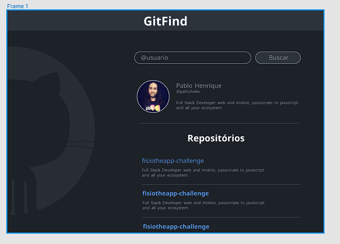

<h1 align="center"> GitFind </h1>

Aplicação que busca e encontra usuários, repositórios, projetos e afins no Github.  

  <a href="#-tecnologias">Tecnologias</a>&nbsp;&nbsp;&nbsp;|&nbsp;&nbsp;&nbsp;
  <a href="#-projeto">Projeto</a>&nbsp;&nbsp;&nbsp;|&nbsp;&nbsp;&nbsp;
  <a href="#-layout">Layout</a>&nbsp;&nbsp;&nbsp;|&nbsp;&nbsp;&nbsp;
  <a href="#-aprendizado">Aprendizado</a>&nbsp;&nbsp;&nbsp;|&nbsp;&nbsp;&nbsp;
  <a href="#memo-licença">Licença</a>

  

 

  

## 🚀 Tecnologias

Esse projeto foi desenvolvido com as seguintes tecnologias:

- HTML e CSS
- JavaScript
- React
- API
- Git e Github

## 💻 Projeto

O GitFind é uma aplicação que busca e encontra dados no Github, seja de usuários, repositórios, projetos e afins, consumindo a API do github.

<!--
[Acesse o projeto finalizado, online](https://Gustavo-Zamai.github.io/dev_links)
- [Assistir aulas](https://lp.rocketseat.com.br/devlinks/inscricao?utm_source=github&utm_medium=descricao&utm_campaign=capture-devlinks&utm_term=organic&utm_content=descricao-github-mayk-brito)
-->
## 🔖 Layout

Você pode visualizar o layout do projeto através [Desse Link](https://www.figma.com/file/IXySq1eGSvvY9nSGLbKcom/GitFind?node-id=2%3A2&mode=dev). É necessário ter conta no [Figma](https://figma.com) para acessá-lo.

## 📑 Aprendizado

Durante esse projeto utilizei conceitos para dar padrão no código, utilizando Eslint, Prettier e Editor Config. 
Foi mostrado uma maneira mais correta para organizar os componentes da aplicação, separando cada um em uma pasta. 
Aprendi a organizar por debaixo dos panos uma aplicação React, configurando o Babel e Webpack.

## 📝 Licença

Esse projeto está sob a licença MIT.

---

Feito com ♥ por Gustavo Zamai 😏😄